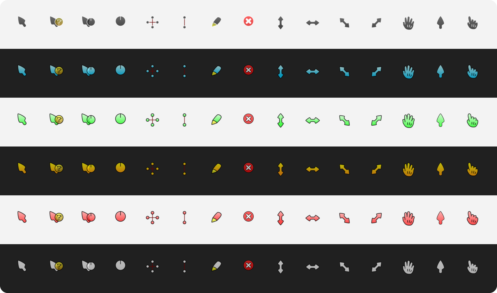
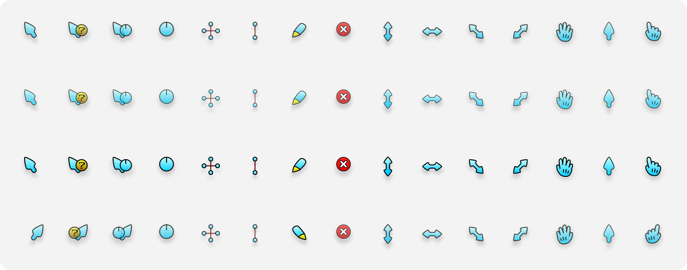

<div align="center">

# Comix Cursors for Windows

**ComixCursors for Windows 11, rendered from the original vector artwork at every size Windows picks for your
display scale and pointer size. 6 colours, Regular and Slim, translucent and Opaque, right- and left-handed.**

[](https://github.com/hervad/comix-cursors-w11-hidpi/releases/latest)
[](#install)
[](COPYING)



</div>

## Install

1. **Download** the zip for the style you want from the [latest release](https://github.com/hervad/comix-cursors-w11-hidpi/releases/latest)
   (see [Pick a variant](#pick-a-variant)) and extract it.
2. **Right-click** `install.inf` in the extracted folder and choose **Install**, then approve the administrator prompt.
   On Windows 11, **Install** is under **Show more options**.
3. **Apply:** Mouse Properties may open by itself; if it doesn't, press <kbd>Win</kbd>+<kbd>R</kbd> and run `main.cpl`.
   On the **Pointers** tab, pick the scheme and click **OK**.

If Windows ever shows a different scheme after you change the pointer size, pick Comix again in `main.cpl`.

## Pick a variant

Every combination on the original theme page is here - 48 in all. Choose one option from each row:

| | Options |
| --- | --- |
| **Colour** | Black, Blue, Green, Orange, Red, White |
| **Outline** | Regular, or **Slim** (thinner outline) |
| **Body** | translucent (the original look), or **Opaque** |
| **Hand** | right-handed, or **LH** (left-handed: mirrored, the click point on the right) |

The zip and the scheme name list the options in a fixed order, leaving out the defaults:

| Example | Zip | Scheme name in Mouse Properties |
| --- | --- | --- |
| Blue | `comix-blue-w11-hidpi-v….zip` | Comix Blue W11 HiDPI |
| Slim, Red | `comix-slim-red-w11-hidpi-v….zip` | Comix Slim Red W11 HiDPI |
| Opaque, Slim, White | `comix-opaque-slim-white-w11-hidpi-v….zip` | Comix Opaque Slim White W11 HiDPI |
| Left-handed, Opaque, Black | `comix-lh-opaque-black-w11-hidpi-v….zip` | Comix LH Opaque Black W11 HiDPI |



*Blue, top to bottom: Regular, Slim, Opaque, left-handed.* Translucent cursors let the background show through their
body and outline (70 % opaque, as in the original); Opaque ones are fully solid.

## Why they stay sharp

Windows doesn't scale cursors smoothly. It takes the pointer size from **Settings › Accessibility › Mouse pointer
and touch** (size 1 = 32 px, each step adds 16 px), multiplies it by a factor that depends on your display scale,
and then looks for an image of exactly that size inside the cursor file. If the file doesn't have it, Windows
resamples the nearest one, and resampling blurs.

Every cursor here contains each of those sizes, rendered from the original vector artwork, never resampled:

| Display scale | Pointer size 1 | Size 2 | Size 3 | Size 4 | Size 5 | |
| --- | :-: | :-: | :-: | :-: | :-: | --- |
| 100–149 % | 32 px | 48 px | 64 px | 80 px | 96 px | measured |
| 150–199 % | 48 px | 72 px | 96 px | 120 px | 144 px | measured |
| 200–249 % | 64 px | 96 px | 128 px | 160 px | 192 px | assumed |
| 250–299 % | 80 px | 120 px | 160 px | 200 px | 240 px | assumed |
| 300 %+ | 96 px | 144 px | 192 px | 240 px | 256 px | assumed |

The two **measured** rows come from a size probe on Windows 11 25H2 (build 26200), where the factor is 1.0 from
100 % to 149 % and 1.5 from 150 % to 199 %. The **assumed** rows continue that pattern; they couldn't be measured
on the test screen, so the files simply include those sizes as well. Larger pointer sizes follow the same rule,
up to Windows' 256 px maximum.

- **Static cursors** are exact for every pointer size in every row.
- **Busy, working and help** (animated) are exact for pointer sizes 1–5 at 100–149 % and 150–199 %. Elsewhere Windows
  resizes the closest image. Animated files carry fewer sizes because the Windows loader limits how large each
  animation frame may be.
- **At 125 % and 175 %** some softness is normal and can't be fixed by any cursor theme: Windows uses the 100 % or
  150 % image there and stretches it to fit.

**No performance cost.** Windows decodes a cursor once, when you switch scheme or pointer size, and animation only
flips between images it has already decoded. Measured on Windows 11 25H2 against Microsoft's own `aero` cursors
(same machine, same run):

| | Comix | Windows aero |
| --- | --- | --- |
| Load a static cursor (32–96 px) | 0.2 ms | 0.1–0.2 ms |
| Load an animated cursor (32–96 px) | 2–5 ms | 1–5 ms |
| Load an animated cursor (256 px) | 33–47 ms | 19–21 ms |
| GDI / USER handles left behind after 300 loads | 0 / 0 | 0 / 0 |

Before every release, GitHub Actions loads every file with the real Windows cursor loader at several sizes; a
failure blocks the release.

## What's included

- **All 17 Windows pointer roles:** normal, help, working in background, busy, precision, text, handwriting,
  unavailable, 4 resize directions, move, alternate, link, location and person select.
  Move is Comix's open hand (the theme has no four-way arrow); location and person select use the pointing hand.
- **Animated cursors as in the original:** busy (a clock hand, 36 frames), working (24 frames) and help (the "?" turns
  over briefly every 2.5 seconds), at 50 ms per frame.
- **Hotspots** from the original theme, scaled to every size and mirrored for the left-handed set.
- `install.inf` and `uninstall.cmd` for each variant, plus the license files.

## Tips

- **Shadow:** the original theme drew a faint shadow into each image. Windows draws its own, so it isn't baked in
  here. For the closest look, turn on **Settings › Accessibility › Mouse pointer and touch › Enable mouse pointer shadow**.
- **Left-handed:** Windows has no left-handed cursor setting; the LH schemes are the way to get mirrored pointers.

## Uninstall

1. Run `uninstall.cmd` from the extracted folder. It removes the scheme from the list and opens Mouse Properties.
2. Pick another scheme and click **OK**.
3. Delete the cursor files from an administrator PowerShell, for example:

```powershell
Remove-Item "C:\Windows\Cursors\Comix Blue W11 HiDPI" -Recurse
```

## Build from source

The cursors are built with [w11-cursor-toolkit](https://github.com/hervad/w11-cursor-toolkit) from the original
repository, pinned as a git submodule in `upstream/` ([that exact commit](https://gitlab.com/limitland/comixcursors/-/tree/115b7a03dc731865cca214f9881a9afa1249eb09)). Rendering needs the native cairo library; see the
toolkit's README for how to get it on Windows or Linux.

```powershell
git clone --recurse-submodules https://github.com/hervad/comix-cursors-w11-hidpi
cd comix-cursors-w11-hidpi
python -m pip install "w11cursor @ git+https://github.com/hervad/w11-cursor-toolkit@v0.3.0"
w11cursor build    theme.toml --out dist                    # all 48 variants (or: --variant blue)
w11cursor validate theme.toml --dist dist
```

The 48 variants in [`theme.toml`](theme.toml) are generated from upstream's colour configuration by
[`tools/variants_from_configs.py`](tools/variants_from_configs.py). Releases are built by GitHub Actions from a version
tag; a local build can differ by a few antialiasing pixels.

## Credits

The artwork is [ComixCursors](https://gitlab.com/limitland/comixcursors) by Jens Luetkens, with Ben Finney and
contributors ([AUTHORS](AUTHORS)), also on [gnome-look](https://www.gnome-look.org/p/999996). This project only
packages it for Windows. See [CREDITS.md](CREDITS.md) for every change from the original.

Licensed under the GNU GPL v3.0 or later, like the original: see [COPYING](COPYING) and [LICENSE.GPL](LICENSE.GPL).
